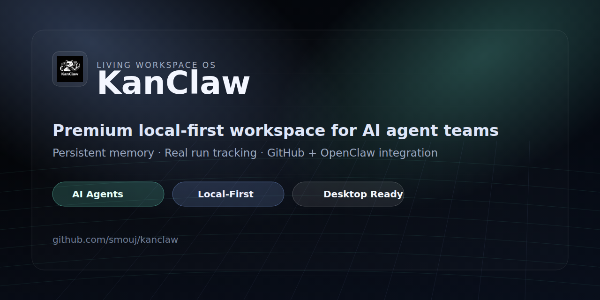

<div align="center">
  <picture>
    <source media="(prefers-color-scheme: dark)" srcset="./assets/social/github-social-preview.png">
    <source media="(prefers-color-scheme: light)" srcset="./assets/social/github-social-preview.png">
    
  </picture>

# KanClaw

**Sistema operativo de workspace local-first premium para equipos de agentes IA**

[](https://opensource.org/licenses/MIT)
[](https://nextjs.org/)
[](https://www.typescriptlang.org/)
[](https://github.com/smouj/kanclaw/pulls)

[English](./README.md) · [Arquitectura](./ARCHITECTURE.md)
</div>

---

## 📦 Última versión

- **v0.3.2** — Toast notifications, Offline indicator, Global search, Skeleton loaders, Run timeline
- Notas: [RELEASE_NOTES_v0.3.0.md](./RELEASE_NOTES_v0.3.0.md)
- Changelog: [CHANGELOG.md](./CHANGELOG.md)

---

## Resumen

KanClaw es un workspace operativo local-first donde humanos y agentes IA colaboran con contexto persistente, memoria estructurada, gestión de tareas e integración profunda con GitHub.

### ¿Por qué KanClaw?

- **Contexto persistente** con Memory Hub (Knowledge, Decisions, Artifacts, Runs)
- **Almacenamiento local-first** con SQLite + sistema de archivos
- **Trazabilidad real** de ejecuciones de agentes
- **Conector GitHub seguro** con manejo local de PAT
- **UI premium** siguiendo la filosofía "Anti-AI Slop"

---

## Inicio rápido

### 1) Clonar e instalar

```bash
git clone https://github.com/smouj/kanclaw.git
cd kanclaw/frontend
npm install
```

### 2) Configurar entorno

```bash
cp .env.example .env
```

### 3) Inicializar base de datos

```bash
npx prisma generate
npx prisma db push
```

### 4) Arrancar en desarrollo

```bash
npm run dev
```

Abrir: `http://localhost:3020`

---

## Stack técnico

- **Frontend:** Next.js 14 (App Router), React 18, TypeScript
- **Estado:** React Context + Custom Hooks
- **UI:** Tailwind CSS, shadcn/ui, Lucide Icons
- **Datos:** Prisma + SQLite
- **Integraciones:** OpenClaw (HTTP/WS), GitHub REST

---

## Estructura del proyecto

```
kanclaw/
├── frontend/            # App Next.js (todo el proyecto)
│   ├── app/             # Next.js App Router
│   ├── components/      # Componentes React
│   ├── lib/             # Utilidades y helpers
│   ├── prisma/         # Schema de base de datos
│   └── public/         # Assets estáticos
├── docs/               # Documentación API
├── assets/             # Assets visuales
├── ARCHITECTURE.md     # Arquitectura detallada
└── CHANGELOG.md        # Historial de cambios
```

---

## Scripts disponibles

- `npm run dev` — servidor de desarrollo (puerto 3020)
- `npm run build` — build de producción
- `npm run start` — servidor de producción
- `npx prisma generate` — generar cliente Prisma
- `npx prisma db push` — sincronizar esquema
- `npm run lint` — linting
- `npm run test` — tests unitarios

---

## Despliegue

### Desarrollo local

```bash
npm run dev
# Abrir http://localhost:3020
```

### Producción (VPS)

```bash
npm run build
npm run start
# O usar Docker/PM2
```

Puerto por defecto: **3020**

---

## Dirección de diseño

KanClaw sigue una guía estricta **Anti-AI Slop**:

- Lenguaje visual cinematográfico y sobrio
- Alto contraste y jerarquía legible
- Espaciado intencional y motion moderado
- Sin gradientes IA genéricos ni efectos ruidosos

---

## Banner del repositorio

Se incluye un banner optimizado para GitHub en:
- `assets/social/github-social-preview.png` (1280×640)

Para activarlo en GitHub:
1. Ve a **Settings → General** del repositorio
2. Busca **Social preview**
3. Sube `assets/social/github-social-preview.png`
