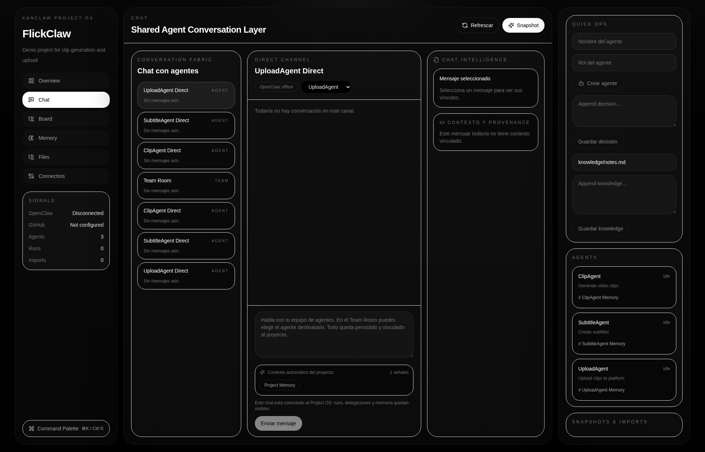

<div align="center">

# KanClaw

**Sistema Operativo de Workspace Local-First Premium para Equipos de Agentes IA**

[](https://opensource.org/licenses/MIT)
[](https://nextjs.org/)
[](https://www.typescriptlang.org/)
[](https://tauri.app/)
[](https://github.com/smouj/kanclaw/pulls)

---

[English](./README.md) · [简体中文](./README.zh.md) · [Arquitectura](./ARCHITECTURE.md)

</div>

---

## ¿Qué es KanClaw?

KanClaw es un **sistema operativo de workspace local-first premium** para equipos de agentes IA. Proporciona un entorno persistente y cinematográfico donde humanos y agentes IA colaboran en proyectos con memoria estructurada, gestión de tareas, chat en tiempo real y profunda integración con GitHub.

### ¿Por qué KanClaw?

| Problema | Solución KanClaw |
|----------|------------------|
| Contexto disperso entre prompts | Memory Hub estructurado con Knowledge, Decisions, Artifacts |
| Sin persistencia entre sesiones | Almacenamiento local-first con SQLite + sistema de archivos |
| Delegación ciega a agentes IA | Runs con seguimiento en tiempo real y provenance |
| Herramientas desconectadas | Conector GitHub con autenticación PAT, cifrado local |
| Interfaces genéricas de IA | Diseño cinematográfico premium con filosofía "Anti-AI Slop" |

---

## Inicio Rápido

### Instalación con Un Comando

```bash
# Clonar e instalar con un solo comando
curl -sL https://raw.githubusercontent.com/smouj/kanclaw/main/scripts/install.sh | bash
```

### Instalación Manual

```bash
# 1. Clonar el repositorio
git clone https://github.com/smouj/kanclaw.git
cd kanclaw/frontend

# 2. Instalar dependencias
npm install

# 3. Configurar entorno
cp .env.example .env

# 4. Inicializar base de datos
npm run db:generate
npm run db:push

# 5. (Opcional) Sembrar datos demo
npm run seed

# 6. Iniciar servidor de desarrollo
npm run dev
```

Abre [http://localhost:3000](http://localhost:3000) en tu navegador.

---

## Características

### 🖥️ Workspace Shell Premium
- Interfaz oscura cinematográfica con capas R3F ambientales
- Paleta de comandos (Cmd+K) para navegación rápida
- Paneles contextuales (sidebar, contenido principal, rail derecho)

### 🤖 Colaboración con Agentes
- **Sala de Equipo** — Chat global para colaboración humano-agente
- **Canales por Agente** — Conversaciones directas
- **Runs Reales** — Seguimiento de ejecución en vivo con OpenClaw

### 🧠 Memory Hub
- **Overview** — Grid bento con métricas
- **Knowledge** — Base de información estructurada
- **Decisions** — Decisiones arquitectónicas
- **Artifacts** — Salidas generadas
- **Runs** — Historial de ejecuciones

### 📸 Snapshots
- Exportaciones punto-en-tiempo
- Artefactos JSON para auditoría

### 🔗 Conector GitHub
- Almacenamiento seguro de PAT (cifrado local)
- Listado y previsualización de repositorios
- Importar como proyecto nuevo o enlazar existente

### 📁 Local-First
Todos los datos viven en `~/.kanclaw/workspace/projects/<slug>/`

### 🖥️ Listo para Desktop
Wrapper Tauri 2 para experiencia de escritorio nativa

---

## Capturas de Pantalla

| Dashboard | Workspace de Proyecto | Kanban | Chat de Agentes |
|-----------|----------------------|--------|-----------------|
|  |  |  |  |

---

## Capturas de Pantalla

| Dashboard | Workspace de Proyecto |
|-----------|----------------------|
|  |  |

---

## Stack Tecnológico

| Capa | Tecnología |
|------|------------|
| Frontend | Next.js 14 (App Router), TypeScript |
| Estilos | Tailwind CSS + shadcn/ui |
| Estado | Zustand |
| Drag & Drop | @dnd-kit |
| 3D Ambiental | React Three Fiber (R3F) |
| Base de Datos | Prisma + SQLite |
| Desktop | Tauri 2 |
| Integración IA | OpenClaw (WebSocket) |
| GitHub | REST API con almacenamiento PAT local |

---

## Estructura del Proyecto

```
kanclaw/
├── frontend/                 # Aplicación Next.js
│   ├── app/                # Páginas App Router
│   ├── components/          # Componentes React
│   ├── prisma/             # Esquema de base de datos
│   └── public/             # Assets estáticos
├── backend/                 # Servidor Python (heredado)
├── .github/                # Workflows CI/CD
├── design_guidelines.json  # Spec del sistema de diseño
└── screenshots/            # Documentación visual
```

---

## Comandos Disponibles

| Comando | Descripción |
|---------|-------------|
| `npm run dev` | Iniciar servidor de desarrollo |
| `npm run build` | Build de producción |
| `npm run start` | Iniciar servidor de producción |
| `npm run db:generate` | Generar cliente Prisma |
| `npm run db:push` | Aplicar esquema a la base de datos |
| `npm run seed` | Cargar datos de demostración |
| `npm run lint` | Ejecutar ESLint |
| `yarn desktop:dev` | Ejecutar Tauri en modo desarrollo |
| `yarn desktop:build` | Construir app Tauri |

---

## Variables de Entorno

```env
DATABASE_URL="file:./dev.db"
OPENCLAW_HTTP="http://localhost:3001"
OPENCLAW_WS="ws://localhost:3001/events"
OPENCLAW_BEARER_TOKEN=""
```

---

## Instalador CLI (Próximamente)

Estamos desarrollando un instalador de un comando para KanClaw:

```bash
# Instalación futura
npx kanclaw create mi-workspace
kanclaw start
kanclaw connect github
kanclaw agent add planner
```

¿Te gustaría ayudar a construir el CLI? [¡Contribuciones bienvenidas!](#contribuir)

---

## Filosofía de Diseño

KanClaw sigue una filosofía "Anti-AI Slop":

- ✅ Estética Cinematográfica, Tranquila, Precisa
- ✅ Alto contraste de texto sobre fondos profundos
- ✅ Espaciado lujoso (2-3x lo normal)
- ✅ Movimiento significativo con soporte para reduced-motion
- ✅ Glass morphism con backdrop blur

### Anti-Patrones (Nunca Usar)
- ❌ Gradientes genéricos morados/celestes de IA
- ❌ Layouts centrados en todo
- ❌ Fuente Space Grotesk
- ❌ Tormentas de partículas
- ❌ Dashboards arcoíris

Consulta [`design_guidelines.json`](design_guidelines.json) para la especificación completa.

---

## Arquitectura

Para arquitectura detallada del sistema, ver [`ARCHITECTURE.md`](ARCHITECTURE.md):

- Capas del sistema (Presentación → Estado → Negocio → Datos)
- Esquema de base de datos (entidades Prisma)
- Estructura del sistema de archivos
- Arquitectura de componentes
- Patrones de integración (OpenClaw, GitHub)
- Modelo de seguridad
- Consideraciones de rendimiento

---

## Contribuir

¡Las contribuciones son bienvenidas! Por favor:

1. Fork del repositorio
2. Crear una rama de feature
3. Seguir las guías de diseño en `design_guidelines.json`
4. Ejecutar lint y build antes de enviar PRs

```bash
# Flujo de desarrollo
git checkout -b feat/tu-feature
npm run dev
# Haz tus cambios
git commit -m "feat: tu feature"
git push origin feat/tu-feature
```

---

## Licencia

Licencia MIT — ver [`LICENSE`](LICENSE) para más detalles.

---

<div align="center">

**Construido con 🔥 por [Smouj](https://github.com/smouj)**

*KanClaw — Tu Workspace Local-First para Agentes IA*

</div>
