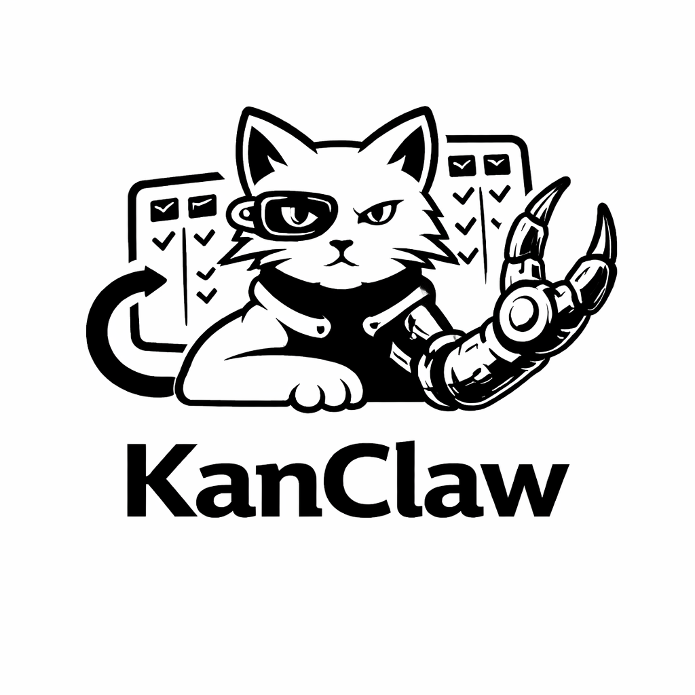
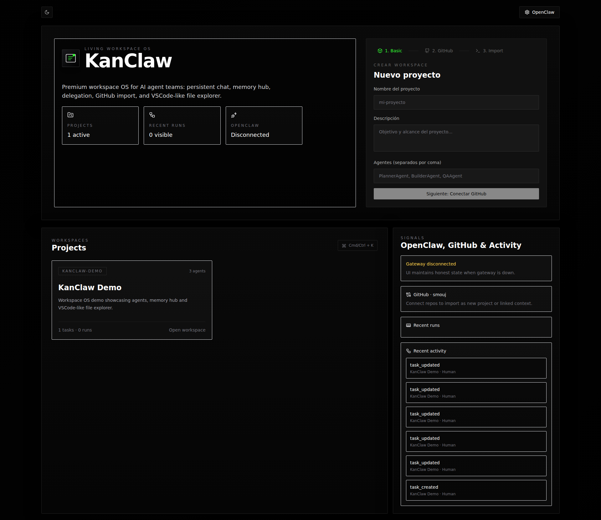
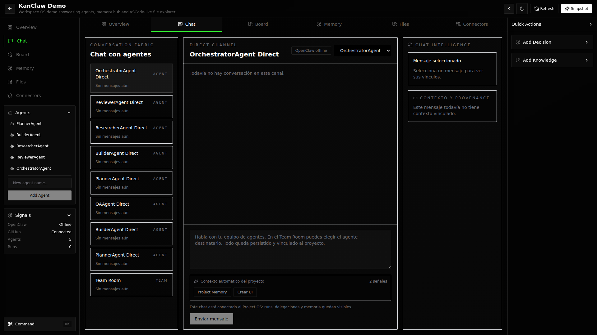

<div align="center">
  <picture>
    <source media="(prefers-color-scheme: dark)" srcset="./frontend/public/kanclaw-logo-dark.png">
    <source media="(prefers-color-scheme: light)" srcset="./frontend/public/kanclaw-logo-light.png">
    
  </picture>

# KanClaw

### Premium Local-First Workspace OS for AI Agent Teams

<p>
  <a href="https://github.com/smouj/kanclaw/stargazers"></a>
  <a href="https://github.com/smouj/kanclaw/network/members"></a>
  <a href="https://github.com/smouj/kanclaw/issues"></a>
  <a href="https://opensource.org/licenses/MIT"></a>
</p>

<p>
  
  
  
  
  
  
  
</p>

[Español](./README.es.md) · [Architecture](./ARCHITECTURE.md) · [Docs Landing](./docs/index.html) · [Open Issues](https://github.com/smouj/kanclaw/issues)
</div>

---

## 📦 Latest release

- **v0.3.0** — Custom React hooks library (useFetch, useDebounce, useLocalStorage, useOnline, and more)
- Notes: [RELEASE_NOTES_v0.3.0.md](./RELEASE_NOTES_v0.3.0.md)
- Changelog: [CHANGELOG.md](./CHANGELOG.md)

---

## 🧭 Who is this for?

- **Founders** shipping product features with AI copilots
- **Indie hackers** who need speed without losing traceability
- **Small teams** coordinating agent runs with persistent context

> KanClaw helps you move fast with AI while keeping structure, auditability, and delivery quality.

---

## 📚 Table of Contents

- [Why KanClaw](#-why-kanclaw)
- [Feature Highlights](#-feature-highlights)
- [Screenshots](#-screenshots)
- [Quick Start](#-quick-start)
- [Tech Stack](#-tech-stack)
- [Project Structure](#-project-structure)
- [Available Scripts](#-available-scripts)
- [Roadmap](#-roadmap)
- [Contributing](#-contributing)

---

## 🚀 Why KanClaw

KanClaw is a local-first workspace OS where **humans + AI agents** collaborate with persistent context, structured memory, and production-ready team workflows.

| Problem | KanClaw Solution |
|---|---|
| Context gets lost between sessions | Persistent Memory Hub (Knowledge, Decisions, Artifacts, Runs) |
| AI delegation is opaque | Real run tracking with provenance and activity logs |
| Tooling is fragmented | GitHub connector + OpenClaw integration in one interface |
| Generic UI fatigue | Premium cinematic UX with strict anti-slop design system |

---

## ✨ Feature Highlights

- **Workspace Shell:** focused, cinematic interface with command palette and context rails
- **Agent Collaboration:** team room, per-agent channels, real task execution traces
- **Memory Hub:** queryable knowledge, decision records, artifacts and run history
- **Project Ops:** tasks, snapshots, imports, and structured execution loops
- **Desktop-ready:** native packaging via Tauri 2

<details>
<summary><strong>🔎 Product positioning</strong></summary>

KanClaw is designed for indie builders and small teams that need **speed + structure**: move fast with agents, without losing reliability, context, or auditability.

</details>

---

## 🖼 Screenshots

<div align="center">
  <a href="./screenshots/01-dashboard.png">
    
  </a>
  <a href="./screenshots/02-workspace.png">
    
  </a>
</div>

<p align="center">
  <sub>Click any screenshot to open full resolution.</sub>
</p>

> Screenshots are maintained in `./screenshots` and verified against real file paths.

---

## ⚡ Quick Start

### 1) Clone and install

```bash
git clone https://github.com/smouj/kanclaw.git
cd kanclaw/frontend
npm install
```

### 2) Configure environment

```bash
cp .env.example .env
```

### 3) Initialize database

```bash
npm run db:generate
npm run db:push
# optional demo data
npm run seed
```

### 4) Run development server

```bash
npm run dev
```

Open: `http://localhost:3000`

---

## 🧱 Tech Stack

| Layer | Stack |
|---|---|
| Frontend | Next.js 14, React 18, TypeScript |
| Styling/UI | Tailwind CSS, shadcn/ui, dnd-kit |
| State | Zustand |
| 3D Ambient | React Three Fiber, drei, three |
| Data | Prisma + SQLite |
| Desktop | Tauri 2 |
| Integrations | OpenClaw (HTTP/WS), GitHub REST API |

---

## 🗂 Project Structure

```text
kanclaw/
├── frontend/            # Next.js app
├── backend/             # Legacy Python backend
├── docs/                # Landing + static docs
├── screenshots/         # README visual assets
└── ARCHITECTURE.md      # High-level architecture
```

---

## 🛠 Available Scripts

| Command | Description |
|---|---|
| `npm run dev` | Start dev server |
| `npm run build` | Build production bundle |
| `npm run start` | Start production server |
| `npm run db:generate` | Generate Prisma client |
| `npm run db:push` | Push Prisma schema |
| `npm run seed` | Seed demo project data |
| `npm run lint` | Run lint checks |
| `npm run desktop:dev` | Run KanClaw as desktop app (Tauri dev mode) |
| `npm run desktop:prepare-sidecar` | Prepare Next.js standalone sidecar for packaging |
| `npm run desktop:build` | Build desktop installer/bundle |

---

## 🖥 Desktop Installation (Tauri)

KanClaw can be installed as a native desktop app via **Tauri 2**.

### Requirements

- Node.js 20+
- Rust toolchain (`rustup`, `cargo`)
- OS dependencies required by Tauri

### Build installer

```bash
cd frontend
npm install
npm run build
npm run desktop:prepare-sidecar
npm run desktop:build
```

Generated installers/bundles are available under:

`frontend/src-tauri/target/release/bundle/`

> For local desktop testing without packaging, use `npm run desktop:dev`.

---

## 🗺 Roadmap

- [ ] One-command CLI installer
- [ ] Multi-project templates and starter packs
- [ ] Live analytics + observability overlay
- [ ] Expanded automation library for agent workflows

---

## 📈 Why teams share KanClaw

- Clear product story (local-first + agent workflows)
- Professional visual identity and premium UX
- Practical setup (Next.js + Prisma + SQLite + Tauri)
- Ready for rapid iteration and public demos

---

## 🖼 Repository Banner / Social Preview

A production-ready social banner is included at:

- `assets/social/github-social-preview.png` (1280×640)
- `assets/social/github-social-preview.svg` (editable source)

To activate it on GitHub:

1. Open **Repo → Settings → General**
2. Scroll to **Social preview**
3. Upload `assets/social/github-social-preview.png`

This improves link previews and repository click-through on social channels.

---

## 🤝 Contributing

PRs are welcome. For major changes, open an issue first to align on scope, UX direction, and architecture.

### Support the project

If KanClaw helps your workflow:
- ⭐ Star the repository
- 🍴 Fork and build your flavor
- 🐛 Report issues with reproducible steps
- 📣 Share it with #aiagents and #buildinpublic communities
