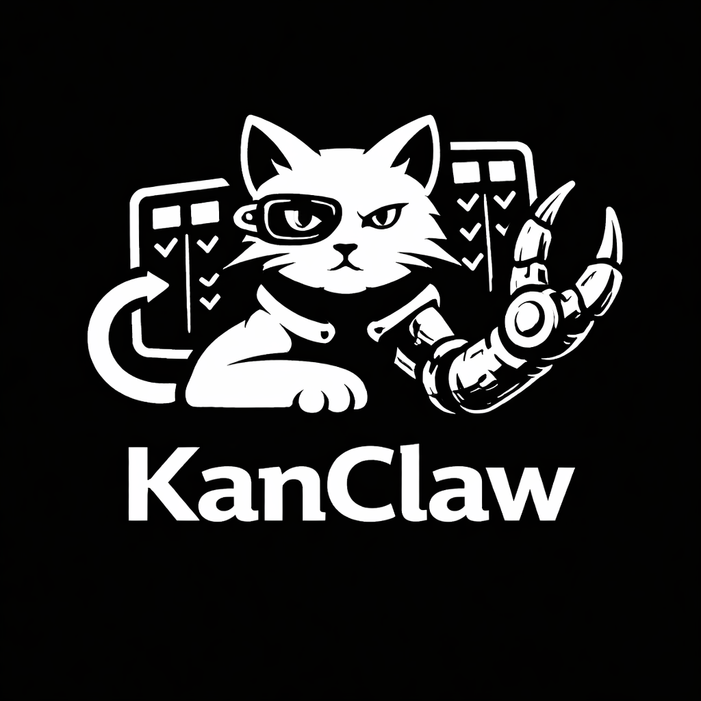

<div align="center">



# KanClaw

### Premium Local-First Workspace OS for AI Agent Teams

[](https://github.com/smouj/kanclaw/stargazers)
[](https://github.com/smouj/kanclaw/network/members)
[](https://github.com/smouj/kanclaw/issues)
[](https://opensource.org/licenses/MIT)

[](https://nextjs.org/)
[](https://react.dev/)
[](https://www.typescriptlang.org/)
[](https://tailwindcss.com/)

[Español](./README.es.md) · [Issues](https://github.com/smouj/kanclaw/issues) · [Discussions](https://github.com/smouj/kanclaw/discussions)

</div>

---

## Latest Release

- **v0.3.2** — Chat telemetry, Board realtime, GitHub picker improvements
- [Release Notes](./RELEASE_NOTES_v0.3.0.md)
- [Changelog](./CHANGELOG.md)

---

## What is KanClaw?

KanClaw is a **local-first workspace OS** where **humans + AI agents** collaborate with persistent context, structured memory, and production-ready team workflows.

Unlike generic AI chat tools, KanClaw provides:
- **Control Plane**: Project governance, context management, and agent coordination
- **Execution Plane**: Delegates to OpenClaw for actual agent runtime
- **Persistent Memory**: Project knowledge that survives sessions
- **Provenance**: Full trace from conversation to execution result
- **Premium UX**: Black/silver cinematic interface

---

## Quick Start

### Prerequisites

- Node.js 18+
- OpenClaw gateway (see below)

### Setup

```bash
# Clone the repository
git clone https://github.com/smouj/kanclaw.git
cd kanclaw/frontend

# Install dependencies
npm install

# Configure OpenClaw (or use defaults)
# Default: http://127.0.0.1:18789

# Start development server
npm run dev
```

Visit **http://localhost:3020**

### OpenClaw Connection

KanClaw requires an [OpenClaw](https://github.com/openclaw) gateway to execute AI agents.

**Default Configuration** (already set in `.env`):
```
OPENCLAW_HTTP=http://127.0.0.1:18789
OPENCLAW_WS=ws://127.0.0.1:18789/events
```

To configure a custom OpenClaw instance, set the environment variables or visit the Settings page in the app.

---

## Features

### Core
- **Multi-Agent Collaboration**: Official 6-agent team + custom agents
- **Real-Time Chat**: SSE-powered live execution with telemetry
- **Kanban Board**: Task management with graph visualization
- **File Explorer**: Multi-source (workspace, GitHub, memory)
- **Memory Hub**: Persistent project knowledge base

### Control Plane (Backend Services)
- **Context Engine**: Curated context packs for AI prompts
- **Model Configuration**: Per-project/agent model selection
- **Provenance**: Full execution tracing (message → run → task → result)
- **Memory Orchestrator**: Handoffs & summaries between agents
- **Repo Intelligence**: Workspace indexing and file search

### Integrations
- **GitHub**: Repository import with search, filters, pagination
- **OpenClaw**: Agent execution runtime
- **i18n**: English, Spanish, French support
- **PWA**: Installable web app
- **Dark/Light Theme**: System preference support

---

## Architecture

```
┌──────────────────────────────────────┐
│         KANCLAW UI                   │
│  Chat │ Board │ Files │ Memory       │
└──────────────┬───────────────────────┘
               │
┌──────────────▼───────────────────────┐
│      KANCLAW CONTROL PLANE            │
│  Context │ Models │ Provenance      │
│  Memory  │ Repo   │ Agent Policy     │
└──────────────┬───────────────────────┘
               │
┌──────────────▼───────────────────────┐
│         OPENCLAW                      │
│  Agent Runtime │ Tools │ Models        │
└──────────────────────────────────────┘
```

**Control Plane** manages project context, memory, and coordination.  
**OpenClaw** handles actual agent execution and tool calls.

---

## Tech Stack

| Layer | Technology |
|-------|------------|
| Framework | Next.js 14 (App Router, Standalone) |
| UI | React 18, TypeScript, Tailwind CSS v3 |
| Database | Prisma + SQLite |
| State | React Context + Hooks |
| Styling | Custom design system with CSS variables |
| PWA | Service Worker, Manifest |

---

## Project Structure

```
kanclaw/
├── frontend/                 # Next.js application (this repo)
│   ├── app/                # App Router pages & API routes
│   ├── components/          # React components
│   ├── lib/                # Core services & utilities
│   ├── prisma/             # Database schema
│   ├── tests/              # Unit tests
│   └── docs/               # Technical documentation
├── docs/                   # Documentation (root)
├── CHANGELOG.md            # Version history
└── README.md               # This file
```

---

## Development

```bash
cd frontend

# Install dependencies
npm install

# Development server (port 3020)
npm run dev

# Lint
npm run lint

# Build
npm run build

# Tests
npm run test
```

---

## Deployment

### Docker (Recommended)

```bash
cd frontend

# Build standalone image
npm run build

# Run with Docker
docker build -t kanclaw .
docker run -p 3020:3020 kanclaw
```

### Node.js

```bash
cd frontend
npm run build
PORT=3020 npm start
```

---

## Environment Variables

| Variable | Default | Description |
|----------|---------|-------------|
| `DATABASE_URL` | `file:./dev.db` | Prisma database path |
| `OPENCLAW_HTTP` | `http://127.0.0.1:18789` | OpenClaw HTTP endpoint |
| `OPENCLAW_WS` | `ws://127.0.0.1:18789/events` | OpenClaw WebSocket |
| `OPENCLAW_BEARER_TOKEN` | - | Authentication token |

### Feature Flags

| Flag | Default | Description |
|------|---------|-------------|
| `USE_AGENT_MODEL_OVERRIDES` | `true` | Per-agent model config |
| `USE_PROVENANCE_V2` | `true` | Enhanced execution tracing |
| `USE_KANCLAW_CONTEXT_ENGINE` | `false` | New context pack builder |
| `USE_MEMORY_ORCHESTRATOR` | `false` | Handoffs & summaries |
| `USE_REPO_INTELLIGENCE` | `false` | Workspace indexing |

---

## Documentation

- [Architecture](./docs/ARCHITECTURE.md) - System design & data models
- [API Reference](./docs/API_REFERENCE.md) - Endpoint documentation
- [Control Plane](./docs/CONTROL_PLANE.md) - Backend services guide

---

## Contributing

Contributions welcome! Please read our [Contributing Guidelines](./CONTRIBUTING.md) first.

1. Fork the repository
2. Create a feature branch
3. Make your changes
4. Run tests and lint
5. Submit a Pull Request

---

## License

MIT License - See [LICENSE](./LICENSE).

---

## Links

- [Website](https://kanclaw.io)
- [GitHub](https://github.com/smouj/kanclaw)
- [OpenClaw](https://github.com/openclaw)
- [Report Issues](https://github.com/smouj/kanclaw/issues)

---

<div align="center">

**Built with ❤️ by the KanClaw Team**

</div>
